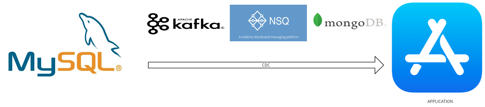

# Galaxy
Galaxy High performance MySQL CDC



## Features
- [x] Infrastructure
- [x] Kafka
- [ ] NSQ
- [ ] Monitorable   
- [x] Recovery synchronization
- [x] Pause synchronization
- [x] Latest synchronization
- [ ] Compliance Test


## depend
- github.com/dollarkillerx/go-mysql

## use
###  mysql configure
Server Config: Ensure server_id is set, and that row-based replication is on.
``` 
$ vi /etc/mysql/my.cnf

[mysqld]
server_id=1
log-bin=master
binlog_format=row
```
Or on a running server:
``` 
mysql> set global binlog_format=ROW;
mysql> set global binlog_row_image=FULL;
```
note: binlog_format is a session-based property. You will need to shutdown all active connections to fully convert to row-based replication.

Permissions: Galaxy needs permissions to act as a replica, and to write to the galaxy database.
``` 
mysql> CREATE USER 'galaxy'@'%' IDENTIFIED BY 'you_password';
mysql> GRANT ALL ON galaxy.* TO 'galaxy'@'%';
mysql> GRANT SELECT, REPLICATION CLIENT, REPLICATION SLAVE ON *.* TO 'galaxy'@'%';

# or for running galaxy locally:

mysql> CREATE USER 'galaxy'@'localhost' IDENTIFIED BY 'you_password';
mysql> GRANT ALL ON galaxy.* TO 'galaxy'@'localhost';
mysql> GRANT SELECT, REPLICATION CLIENT, REPLICATION SLAVE ON *.* TO 'galaxy'@'localhost';
```

## HTTP API
### Get task list  
  
HTTP: `GET /v1/task`

curl: `curl --location --request GET '127.0.0.1:8689/v1/task'`

### Issuing tasks 

HTTP: `POST /v1/post_task`

JSON BODY:
```json
{
  "task_id": "task_id", // Current Task Unique ID
  "mysql_config": {     // Listening mysql configuration
    "user": "root",
    "password": "root",
    "host": "192.168.88.11",
    "port": 3307
  },
  "database": "test", // Listening database
  "tables": [],  // Listening data sheet, if len(tables) == 0 Listen to all tables under the current db
  "exclude_table": [] , // Tables that do not listen
  "start_time": 1624355996,  // Optional value, default only listens to the latest [This feature is very performance hungry (not recommended)]
  "kafka_conf": {  // Optional value, 
    "enable_sasl": false,
    "brokers": [
      "192.168.88.11:9082",
      "192.168.88.11:9083",
      "192.168.88.11:9084"
    ],
    "user": "user",  // Optional value, if enable_sasl is true is required
    "password": "password" // Optional value, if enable_sasl is true is required
  },
  "nsq_conf": {}, // Optional value, 
  "mongo_db_conf": {}, // Optional value, 
  "es_conf": {} // Optional value, 
}

// The current system only supports kafka
```

curl: 
``` 
curl --location --request POST '127.0.0.1:8689/v1/post_task' \
--header 'Content-Type: application/json' \
--data-raw '{
  "task_id": "task_001", 
  "mysql_config": {  
    "user": "root",
    "password": "root",
    "host": "192.168.88.11",
    "port": 3307
  },
  "database": "test",
  "tables": [],
  "exclude_table": [] , 
  "kafka_conf": {  
    "enable_sasl": false,
    "brokers": [
      "192.168.88.11:9082",
      "192.168.88.11:9083",
      "192.168.88.11:9084"
    ]
  }
}'
```

### Suspension of tasks

HTTP: `POST /v1/stop_task`

JSON BODY: 
```json
{
  "task_id": "task_001",
  "stop_type":  "stop"  // params:   1. stop      2.  recovery_v1 (default ,  Resume and continue synchronization)   2.recovery_v2  (Restore Sync Only Latest)
}
```

**stop_type**
``` 
enum stop_type {
    stop                // Stop Synchronization
    recovery_v1         // default ,  Resume and continue synchronization
    recovery_v2         // Restore Sync Only Latest
}
```

CURL :
``` 
curl --location --request POST '127.0.0.1:8689/v1/stop_task' \
--header 'Content-Type: application/json' \
--data-raw '{
    "task_id": "task_001",
    "stop_type":  "recovery_v1"
}'
```

### del task

HTTP: `POST /v1/delete_task/:task_id`

CURL: 
``` 
curl --location --request POST '127.0.0.1:8689/v1/delete_task/task_001'
```

> Warning: If you want to create the currently deleted TaskID, wait for the 11S system to recycle resource recycling

### Modify tasks

HTTP: `POST /v1/update_task`

JSON BODY:
```json
{
    "task_id": "",   // Required
    "database": "",  // Required
    "tables": [],
    "exclude_table": []
}
```
